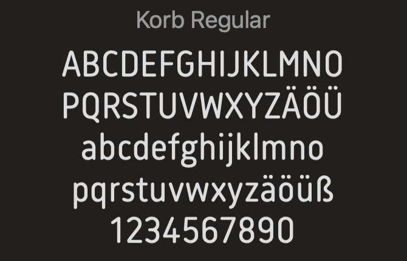

+++
title = "Effinger Fonts"
date = "2024-01-22"
draft = true
image = "bildschirmfoto-2024-01-18-um-21.55.45.png"
+++
Vor Kurzem hatte ich die Gelegenheit, im Effinger, bei der Raumvermietung, die Verantwortung für die Signalethik und das Design zu übernehmen. Während des Designprozesses wurde mir bewusst, wie vielfältig die Signalethik im Effinger ist – sei es auf den Türen, Wänden oder dem Menü an der Kaffeebar. Vieles davon fällt nicht sofort ins Auge. Wenn man sich nicht damit befasst.

Nach diesem Bewusstsein führte ich ein Gespräch mit Christine (die für meinen Auftrag zuständig war) dazu, darüber nachzudenken, wie die Raumsignalethik noch übersichtlicher gestaltet werden könnte, besonders für die Menschen, die neuerdings selbstständiger bei der Raummiete vorgehen müssen als zuvor.

Gemeinsam überlegten wir, wie wir dies im „Effinger-Look“ umsetzen könnten, und kamen unteranderem zum Schluss, Pfeile mit den Raumnamen und dem „Effinger Font“ zu drucken. (Das ist noch nicht umgesetzt worden, aber wird bald erscheinen)

Das bedeutete für mich, herauszufinden, welche Schriftarten der Effinger verwendet. Diese Frage erwies sich als schwierig, insgesamt fragte ich acht Personen im Effinger, von denen ich annahm, dass sie es wissen würden. Zudem fragte ich zahlreiche Apps, die mir versprachen, die "richtige" Schrift zu identifizieren.

Nach einer Woche und vielen E-Mails, in denen ich die falsche Schrift erhielt, erfuhr ich von Isabel, die mit Claudine redte, die mit der füheren Grafikerin sprach, dass der Font den Namen "Korb" trägt. 

Also falls jemand mal im Effinger wieder diesen Font sucht weisst du jetzt wie er heisst. :)