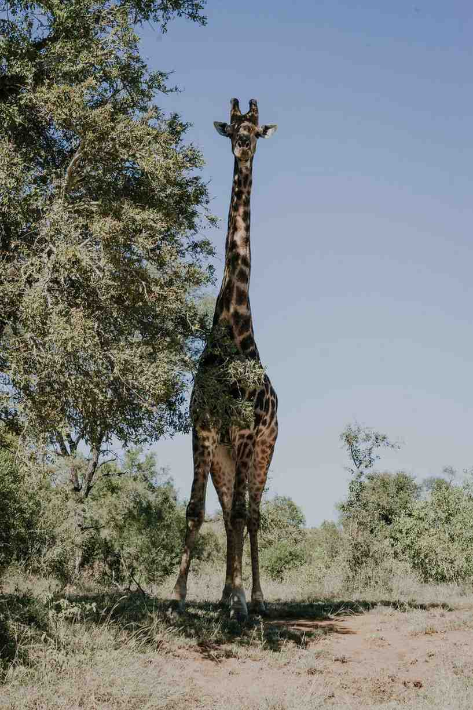

+++
title = "Fotografien aus Südafrika"
date = "2024-06-12"
draft = false
image = "ssp09369kopie.jpg"
+++
Vor etwa einem Monat war ich in Afrika und habe in der Zeit echt viel erlebt.

Eine Sache, die ich unbedingt machen wollte, war meine Kamera mitzunehmen. Ich liebe es nämlich zu fotografieren. Normalerweise fotografiere ich oft nur für andere vor allem, wenn es um digital Fotografie geht (meistens für meinen Freundeskreis oder für Events) aber diesmal wollte ich einfach für mich selbst ein paar Momente festhalten und es ganz locker lassen. 

Die meisten Bilder sind während einer Safari entstanden, die wir an unserem freien Tag gemacht haben und ein paar andere auf unserer Homebase (wo wir die meiste Zeit verbracht haben, wenn wir nicht gerade bei einem Projekt geholfen haben). Hier sind ein paar der Bilder

