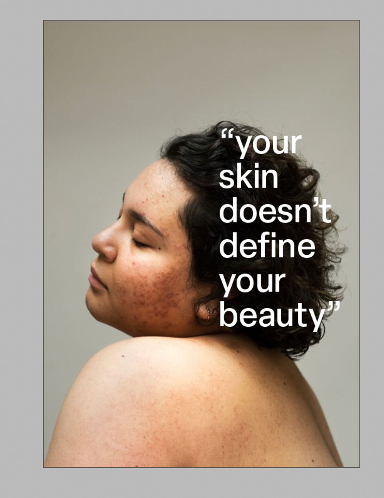

+++
title = "Skin Positivity Graphic Posters"
date = "2023-11-07"
draft = false
image = "imresizer-1699299424371.jpg"
description = "Skin Positivity Graphic Posters "
+++
In today’s world, where social media and the beauty industry often promote unrealistic beauty standards, it is important to create spaces that promote diversity and self-acceptance.

 I recently came across a photographer called Sophie Harris Taylor. I was inspired by her photography project called “Epidermis”. In her project Epidermis she highlights and showcases the skins of women seen less often, and she captures this in a very beautiful way.

 These images let me realize that I could create a series of posters with the idea of displaying Sophie’s images and to raise awareness on this very complex issue/topic.

 My process was to start with some sketches. My initial steps involved sketching out various designs and the main idea was to keep the design quite simple to viewers pay more attention to the photograph rather than the design/typography. I also started looking on Pinterest for posters that inspired me for this series. Following that I searched for font that would look good.

 After that I just stared to experiment. I tried different variations of how to display the text, and what how I could draw the viewer’s attention to the subject rather than the typography. In the end I came up with about 6 layouts, of one poster, that I was happy with.

 These are two are the posters I particularly liked.

My vision was to keep the typo as minimalistic as possible as I mentioned before. I choose a typography that resembles that in my opinion. Even though this project is still a not quite done, I had lots of fun creating these.